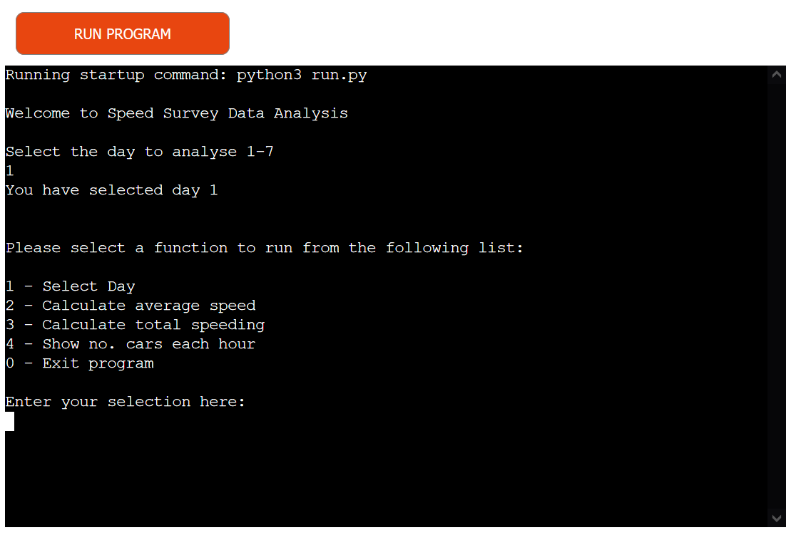
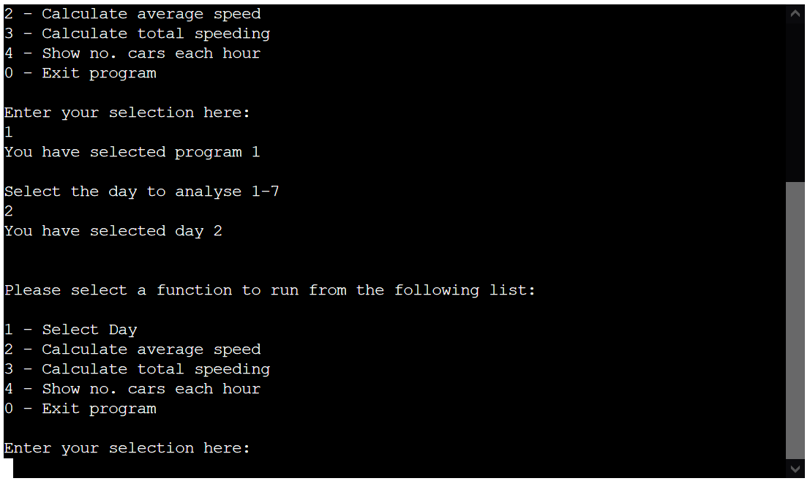
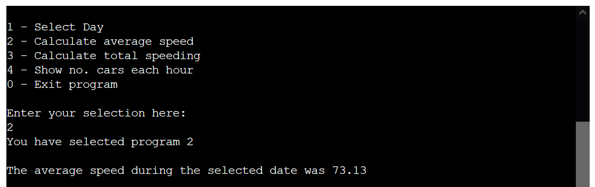
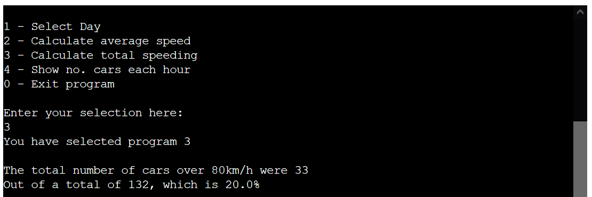
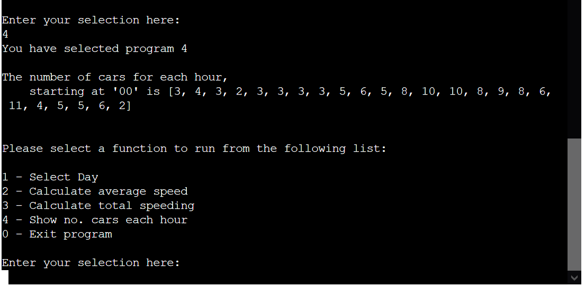

# Speed Survey Data Analysis

Speed Survey Data Analysis is a program designed to take in data from a speed survey and calculate specific values from it.
It will be useful to someone that is interested in whether or not the road has the appropriate speed limit, or what the traffic levels are like.
The live version of the project is located at https://speed-survey-p3.herokuapp.com/

### Existing Features

- __Function Selection__

- Enables the user to choose which funtionality of the program to utilise.

- __Data Selection__

  - Allows the user to select the day that they wish to analyse

- __Average Speed__

  - Calculates the average speed on the road for a selected day
  - This function will allow the user to gauge the speed levels of traffic on the road

- __Total Speeders__

  - The total speed function allows the user to see how many drivers were above the speed limit
  - The user can then see if the road has a speeding issue

- __Hourly Counts__ 

  - The hourly counts function allows the user to see how many cars were on the road for every hour of the day
  - This shows the user at which times the road is busy, which could aid in implementation of variable speed limits as an example

### Features Left to Implement

- Allow the user to analyse the entire data simultaneously
- Link the speeds and times for analysis e.g. at what time people were speeding at

## Testing 

The program has been manually tested by:
- Inputting information that is not relevant (i.e. program "f" which is not an option)
- Testing in the Gitpot and Heroku terminals

## Bugs

- When selecting a new date, the program would crash, as the source of the selection was being overwritten by the initial data selection.

### Validator Testing 

- CI Python Linter
  - One error (E501 line too long)  [CI Python Linter](https://pep8ci.herokuapp.com/#)
  - 

## Deployment

The site was deployed using Code Insttitute's mock terminal for Heroku.

- Steps for deployment
  - Fork or clone this repository
  - Create a new Heroku app
  - Set the buildbacks to Python and NodeJS in that order
  - Link the Heroki app to the repository
  - Click on Deploy
  - Wait a few moments for the project to build, which will be signified by a link appearing at the bottom

## Credits 

- Code Institute for the template used for the mock terminal
- Google Sheets for the spreadsheet imported

### Content 